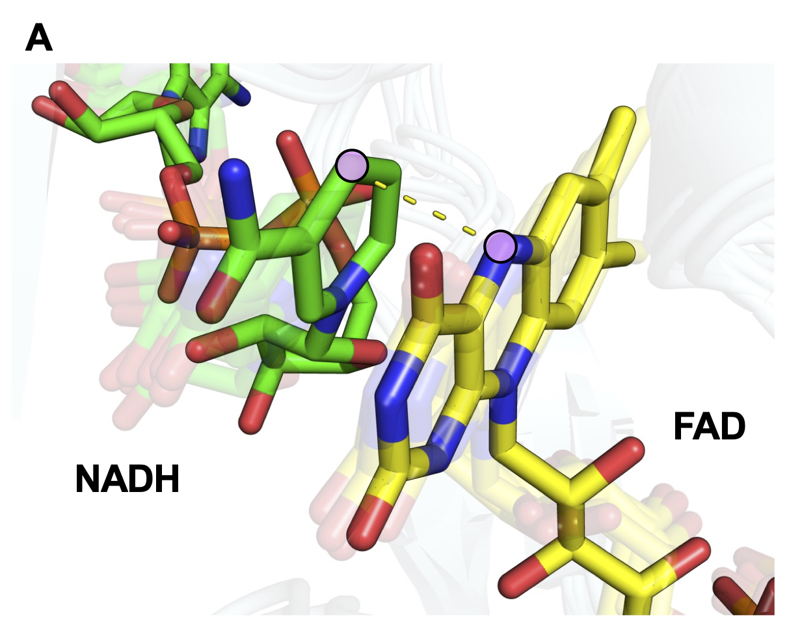

# Nox Engineering

This repository contains the source data and code related to engineering _Lactobacillus pentosus_ NADH oxidase (_Lp_ NOX) to utilize noncanonical cofactor biomimetics (NCBs) such as NMNH, MNAH, and BNAH. Our high-throughput growth selection enabled the discovery of Nox variants with enhanced NCB activity, and molecular modeling suggests that the mutations promote catalysis with NCBs by fine-tuning conformational dynamics to more closely match the ensemble of states sampled with the native cofactor NADH bound.

## Contents

- `00_raw_data`
  - Source data for analysis and figures
- `01_rosetta_setup`
  - PyRosetta script to mutate template Lp_NOX homology model
- `02_amber_setup`
  - AMBER input files and scripts to process trajectory data
- `03_loop_flexibility`
  - Notebook plotting binding pocket loop flexibility
- `04_hydride_transfer`
  - Notebook analyzing hydride transfer ability
- `05_free_energy_landscape`
  - Notebook comparing conformational free energy landscapes for protein-cofactor complexes

## Citation

_To be updated upon acceptance_
